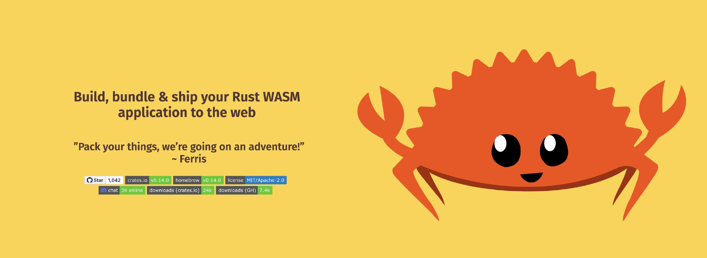

# trunk_demo

Demo shows how to setup Rust + WASM project using [trunk](https://github.com/thedodd/trunk/blob/master/Trunk.toml) as build tool.

## How to start

- Clone repo
- Install trunk: `cargo install trunk`
- Build and run: `trunk serve`

## Links

- [Configuration file](https://github.com/thedodd/trunk/blob/master/Trunk.toml)
- [Assets](https://trunkrs.dev/assets/)
- [Configuration](https://trunkrs.dev/configuration/)